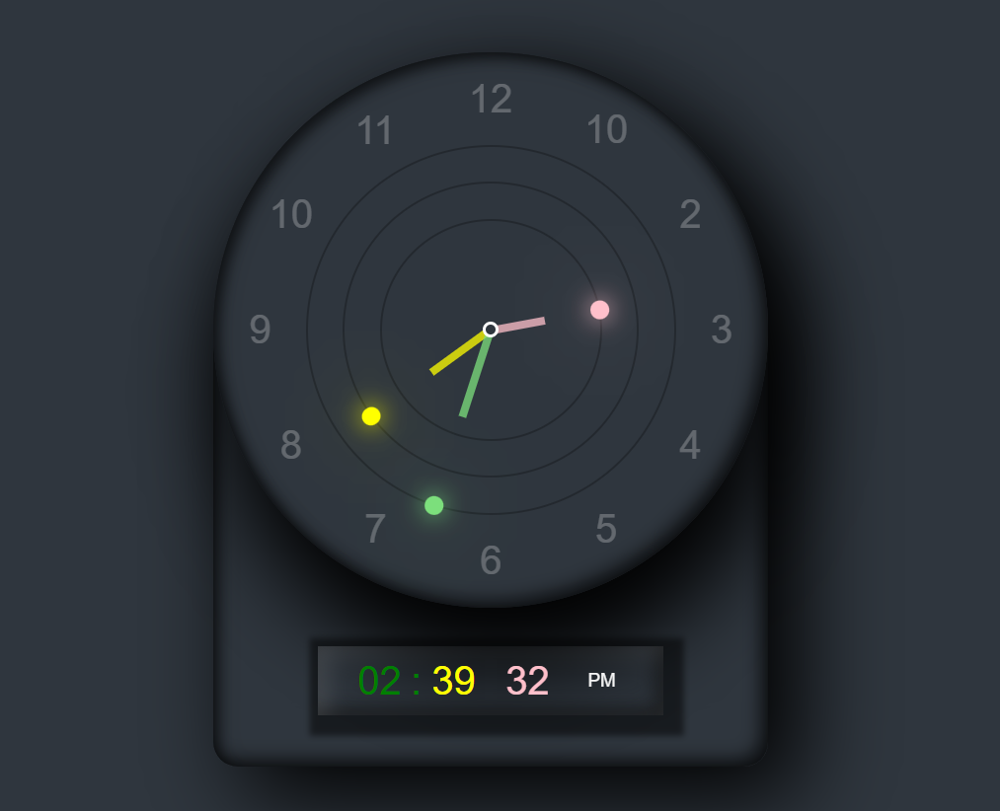

# Analog + Digital Watch

A stylish analog + digital watch with a beautiful user interface created using pure HTML, CSS, and vanilla JavaScript is a small beginner friendly project and good for beginning of frontend development .

## Features

- Analog clock with smooth ticking second hand.
- Digital clock displaying current time in a 12-hour format.
- Elegant and responsive design.

## Preview

## Things you can learn.
<h3>CSS</h3>
- CSS code demonstrates a combination of flexbox, pseudo-elements, animations, and other styling techniques to create a visually appealing and dynamic analog + digital watch interface.

<h3>Javascript</h3>
- Analog Clock:
The analog clock JavaScript program focuses on creating a visually appealing representation of time. It utilizes <b>DOM manipulation</b> to select clock hands and employs the <b>setInterval function</b> to dynamically update the rotation of the hour, minute, and second hands every second. The code showcases the <b>calculation of rotation degrees based on the current time </b>, allowing for the creation of a classic analog clock interface.

-Digital Clock:
In the digital clock JavaScript program, the emphasis shifts to displaying time in a digital format. By <b>querying DOM elements</b>, the code accesses the hour, minute, second, and AM/PM indicators. The show function formats the current time into a 12-hour clock, and a <b>ternary operator</b> determines whether it's AM or PM. Real-time updates are achieved through the setTimeout function, ensuring the digital clock stays synchronized with the system time. Additionally, <b>string manipulation techniques</b> are employed to format time elements with leading zeros when necessary.

-General Concepts:
Both parts of the code exhibit common programming concepts such as DOM manipulation for interactive web elements, the use of the Date object for time-related functionalities, and the implementation of conditional statements to adjust the clock display based on the current time. The integration of interval and timeout functions highlights the dynamic and real-time nature of these clock displays, providing insights into how JavaScript can be applied to create engaging and functional user interfaces.

## How to Use

1. Clone the repository:

 - git clone https://github.com/featitx/analouge_watch

2. Open the project :

 - Open the index.html file in your preferred web browser.

[Enjoy the stylish analog + digital watch!]

## Customize
Feel free to customize the styles or add additional features to make the watch suit your preferences. The code is written using pure HTML, CSS, and vanilla JavaScript, making it easy to modify.

## Contributing
If you'd like to contribute to this project, please follow the contribution guidelines.

## License
This project is licensed under the MIT License - see the LICENSE file for details.

Additionally, create separate files for `CONTRIBUTING.md` and `LICENSE` with their respective content. Here's an example for `CONTRIBUTING.md`:

# Contributing Guidelines

Thank you for considering contributing to the Analog + Digital Watch project!

## Pull Requests

1. Fork the repository.
2. Create a new branch for your feature: `git checkout -b feature-name`.
3. Commit your changes: `git commit -m 'Add new feature'`.
4. Push to the branch: `git push origin feature-name`.
5. Open a pull request with a detailed description of your changes.

## Issues

If you find any issues or have suggestions, please open an issue.
We welcome all contributions and appreciate your help in making this project better!

## For any help

(ping me on).
-LinkedIn - [https://www.linkedin.com/in/abdul-r-siddique-a23257210/]
-Gmail - [siddabdul7@gmail.com]

